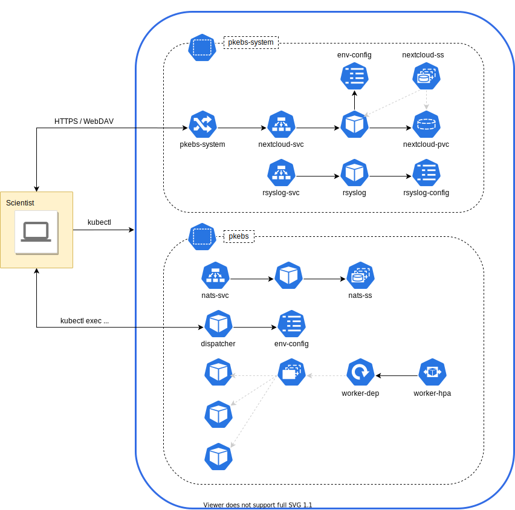
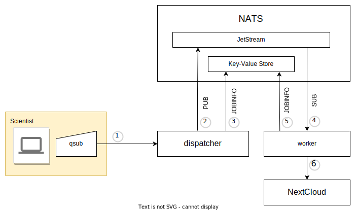

# pkbs - Personal Kubernetes Batch System

## About

This software harnesses Kubernetes to run batch jobs.

## Design



Storage service and centralized logging resides in the `pkbs-system`
namespace. The reference implementation uses NextCloud with persistent
storage, but external service can also be utilized.  The logical
'queue' is implemented in the `pkebs` namespace with NATS messaging
system, `dispatcher` pod, and `worker-dep` deployment.  The horizontal
autoscaler `worker-hpa` dynamically adjusts the worker replicas based
on processing workload.



Right: schematics of the job processing flow.  The `qsub` invoked
by the user (1) submits the job to the `dispatcher` pod, which then publishes
it (2) to the NATS JetStream and creates the job's bookkeeping data
(3) in the key-value store.  The workers get their input (4) from the
JetStream and update the job state data (5) in the key-value
store. Worker instances have no persistent storage, therefore they
upload (6) their results to a storage service.

## Getting Started

### Prerequisites

* GNU/Linux workstation or server, virtual machine (VM) works fine
* [GNU Make](https://www.gnu.org/software/make/)
* [Docker](https://docs.docker.com/get-docker/)
* [kubectl](https://kubernetes.io/docs/tasks/tools/)
* [kustomize](https://kubectl.docs.kubernetes.io/installation/kustomize/)
* Kubernetes cluster
* Optional: access to an external WebDAV (e.g., [NextCloud](https://nextcloud.com)) service

### Installation

### Submitting batch jobs

Commands can be read from standard input.
```
echo "sleep 1" | qsub -N sleep
```
The `qsub` can be invoked with an executable file as an argument.
```
qsub -N calc examples/calculation/calc.sh
```
The `qsub` can be invoked with a directory name as an argument. In this case, the directory must include a file named `run.sh` at the top level. The contents of the directory is then zipped up and submitted for scheduling. There zip file can be at most 1 MB.
```
qsub -N hello-world examples/hello-world
```
In all cases the payload can be up to 1 MB.

## Contributing

All contributions are welcome. Bug reports, suggestions and feature
requests can be reported by creating a new
[issue](https://github.com/ptrktn/pkbs/issues). Code and documentation
contributions should be provided by creating a [pull
request](https://github.com/ptrktn/pkbs/pulls) (here is a good
[tutorial](https://www.dataschool.io/how-to-contribute-on-github/)).
Run `make tidy-sources` before committing and use imperative mood in
commit messages.

## License

Licensed under the GNU General Public License Version 3, refer to the
file [LICENSE](LICENSE) for more information.

## Acknowledgments

* University of Helsinki, for their [DevOps with Kubernetes](https://devopswithkubernetes.com/) course.
